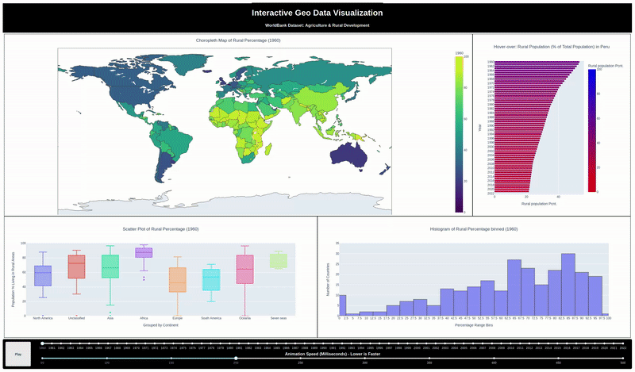

# IU INTERNATIONAL UNIVERSITY OF APPLIED SCIENCES
### Exploratory Geo-spatial Data Analysis: Interactive Visualization for Academic Inquiry (DLBDSEDAV01)

Welcome to the repository dedicated to the exploration of interactive geo-spatial data visualization, with a specific focus on rural areas. Within this repository, we harness the capabilities of Python libraries such as `dash` and `plotly` to construct interactive graphical representations, complemented by CSS for refined dashboard aesthetics.

## Academic Assignment Overview
### Task 3: Geo-spatial Data and Interactive Visualizations
This academic endeavor delves into the extensive realm of data visualization beyond conventional static plots. Our objective is to master the art of crafting a compelling data narrative using geo-spatial data, enriching comprehension through interactivity while steering clear of information overload. We seamlessly integrate interactive maps, spatial data representations, and various graphical formats to empower our audience to dynamically and interactively engage with the data. Moreover, we engage in discussions regarding the appropriateness of this approach for diverse projects and scenarios, elucidating scenarios where it may not be the optimal choice. In doing so, we exemplify how the techniques and principles we have assimilated during our academic journey, substantiated by pertinent literature, elevate data visualizations into captivating and informative data narratives.

### Research Objectives:
1. Select an open geo-spatial dataset that aligns with your academic interests.
2. Apply techniques acquired during the course, complemented by extensive research, to craft an interactive map representation of the chosen data. Emphasis is placed on narrative construction through data, necessitating abstractions, creative choices, and informed technical decisions related to class boundaries and statistical aspects. Thoroughly justify these decisions.
3. Create at least three supplementary non-map visualizations (e.g., scatterplots, barplots) based on the same dataset, ensuring seamless interactivity. User interactions in one visualization should trigger corresponding actions in the non-map visualizations, fostering a coherent data communication strategy. Elucidate the rationale behind this interactivity.
4. Articulate design choices encompassing aspects such as color selection, layout, and overall aesthetics. Evaluate the appropriateness of these design elements in enhancing the narrative quality of the visualizations. Present a meta-perspective through discussions and conclusions drawn from your work, comparing it to existing studies in the academic literature. Describe the influence of technical and creative decisions on your project outcomes and offer valuable insights derived from your work.

### Purpose
In today's era, characterized by the ascendancy of big data, the ability to effectively interpret extensive datasets, especially geo-spatial time-series data, is paramount. Our project seeks to unearth intuitive and interactive means of unveiling concealed patterns and trends within such datasets. We are driven by the imperative of creating high-caliber visualizations that adhere to the rigorous design principles expounded in academic literature. Central to this endeavor is the critical process of data cleaning, entailing the identification and meticulous handling of missing values, outliers, and non-standard entries. This process equips us with proficiency in working with DataFrames, a cornerstone of Data Science, indispensable for dataset manipulation and analysis.

# Approach
Our dataset of choice is the WorldBank dataset on Agriculture & Rural Development, an extensive repository of numerical data spanning from 1960 to 2022, encompassing diverse indicators. In our exploration, one indicator, in particular, stood out - the percentage of people living in rural areas.

Comparison between Absolute and Percentage

Initially, we considered the absolute count of rural inhabitants. However, during the visualization phase, it became evident that the data exhibited a pronounced skew towards China and India. This skew necessitated a deliberation on axis scaling or data normalization. Consequently, we opted to employ the population percentage, fostering equitable global country comparisons.

## Dataset Selection
Following the selection of the indicator of interest, *Rural population (% of total population)* with the indicator code *SP.RUR.TOTL.ZS*, we scrutinized the numerical data spanning from 1960 to 2022. Due to a substantial number of missing values in the years 2022, we made the strategic decision to exclude this column. Subsequently, the number of missing values was significantly reduced, and the remaining gaps were filled judiciously with zeros.

# Key Findings
A prevailing global trend since 1961 has been a consistent reduction in rural populations. Africa consistently recorded the highest percentage of people living in rural areas, peaking at 96.33%, followed by Asia at 95.18%, and Oceania at 90.72%. As of 2020, Africa continued to maintain the highest figures, with 86.29%, followed by Oceania at 86.65%, and Asia at 81.28%. Conversely, in 1961, Europe exhibited the highest urbanization rate, with a mere 45.01% of its population residing in rural areas. South America trailed with a median of 52.65%, and North America with 59.06%. Fast forward to 2020, and the tables have turned, with South America leading the urbanization trend at a median of 20.14%, followed by North America at 27.73%, and Europe at 28.50%. The chloropleth map unmistakably reveals that Africa and Asia continue to harbor the highest rural populations. Future research endeavors could delve into the multifaceted factors underpinning this phenomenon.

# Interactive Geo-spatial Data Visualization Example
Live Demo

The speed can be used to change the update interval. However for slower machines or slow connection it's recommended to use a refreshrate above 500ms.

# Reflection
Our work with interactive geo-spatial data compellingly underscores the potency of a single visualization. Traditional tabular formats and static charts often obfuscate the geographical context, depriving the viewer of crucial insights tied to geographic location. Interactive elements not only invite users to explore their questions but also unearth novel perspectives. Throughout this project, our design choices were meticulously considered to maintain clarity and conciseness. For instance, color was judiciously employed to enhance comprehension, with the gradient scale in the chloropleth map facilitating percentage visualization and catering to individuals with color vision impairments. The boxplot utilized color for differentiation, augmented by continent labels. Meanwhile, the bar chart accentuated individual countries upon hover, amplifying the distinct trends present.

# Conclusion
This project serves as a testament to the profound impact of design principles encompassing clarity, color utilization, interactivity, and the insights that emerge from geo-spatial data exploration. Through this undertaking, we have unraveled the nuanced complexities of geolocation and rural population percentages.

# AWS Hosted Dashboard
The server is hosted in Frankfurt (EU) so depending on your location there can be lagg in updating the figures.

You can adjust the fresh rate above 500 ms to slow down the updates and give it time to properly refresh.

Link (Last updated on 5/10/2023): http://ec2-3-79-241-13.eu-central-1.compute.amazonaws.com/

# Running the dashboard locally - Best for latency (advised)
1. `docker pull deusnexus/dash-azure:latest`
2. `sudo docker run -p 8050:80 deusnexus/dash-azure:latest`
3. Now the dashboard should be running on `localhost:8050`

# Building your own Docker image
1. Clone the repository and `cd` into it.
2. Make any changes in application.py and Dockerfile
3. `sudo docker build -t your-dashboard-image .` # This will use the Dockerfile to build the image

# Disclaimer
The application developed within this project is licensed under the GNU General Public License (GPL).